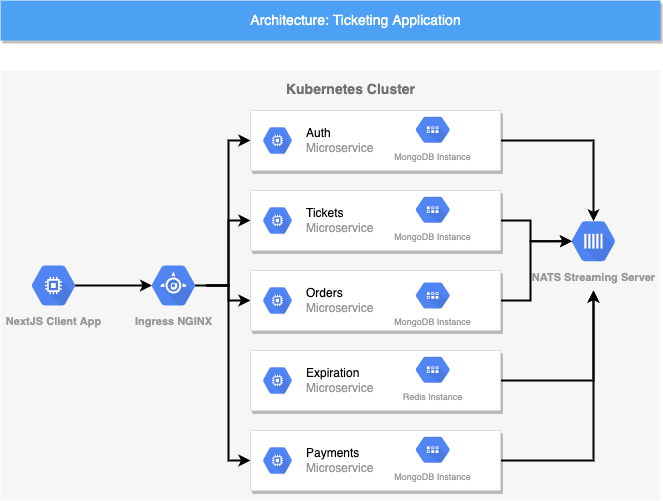

# Ticketing
A ticketing application utilizing microservices architecture from Udemy's Microservices With Node.js and React Course.
In this project, I learned how to build a microservices application using React with Next.js on the front end, and Node.js services written in Typescript utilizing MongoDB, and Nats Streaming Server messaging service on the back end.



## Application Functionality
This application allows users to buy and sell tickets. The following requirements were implemented in this project.
- Users can list a ticket for sale
- Other users can purchase the ticket
- Any user can sell or purchase tickets
- During purchase the user has 60 seconds to complete the transaction during which time the ticket is locked for editing or purchase by other users

## Technical Considerations

After building a simple React & Node microservice application in Javascript at the beginning of the course, the following issues arose during development. These issues are addressed in this project with the following solutions
1. *Lots of duplicated code* -> **Build a common module as an NPM module with code shared between services**
2. *Difficult to understand the flow of events between services* -> **Define all the events in the common module**
3. *No help from IDE with identifying message properties* -> **Write the services using Typescript**
4. *Difficult to test event flows* -> **Write tests using Jest and mock the Nat Streaming Server dependency**
5. *Running Docker Desktop and Kubernetes might cause lagging on computer* -> **Run a k8s cluster in Google Cloud and develop almost as quickly as local**
6. *Concurrency issues not addressed* -> **Utilize Nats Streaming Server to ensure message receipt is acknowledged and version messages being processed by services**

## Getting Started
Clone the repository to your local machine by running the following command in a terminal window or command prompt from the location you wish to copy the folder

`https://github.com/kevinjdev/Ticketing.git`

### Prerequisites
* Install Skaffold to manage deploying the application (https://skaffold.dev/docs/install/)
* Install Docker Desktop and create an account (https://www.docker.com/get-started)
* Enable Kubernetes inside Docker Desktop under the Settings menu
* Add **NGINX Ingress Controller** to your Kubernetes Cluster (https://kubernetes.github.io/ingress-nginx/deploy/)
* Edit skaffold.yaml and replace all instances of 'kevinjdev' with your docker Id
* In the infra directory replace all instances of 'kevinjdev' with your docker Id
* In your local computer's host file add the following on a new line: **127.0.0.1 ticketing.dev**
* Add two secrets for JWT_KEY and STRIPE_KEY to your project with the following commands. You can obtain a Stripe API key from (https://www.stripe.com)
a) kubectl create secret generic jwt-secret --from-literal=JWT_KEY=someRandomString
b) kubectl create secret generic stripe-secret --from-literal=STRIPE_KEY=yourSecretStripeKey
* Edit the stripeKey prop the <StripeCheckout /> component inside client/pages/orders/[orderId].js with your public stripe key 

### How To Run Locally
```
Run the following command from inside your project folder through a terminal window
skaffold dev
Once the application is up and running, open a browser window and navigate to ticketing.dev
If using chrome, you may receive a site security warning. Type thisisunsafe to continue
```
### Explanation of the Running Program
The command skaffold dev will execute the docker files in each folder to build the images. Once the images are built then through Kubernetes, the containers will be created and deployed. The client application is displayed for the user through the browser, and as requests are made to the back end, the requests are routed to the appropriate service through use of Ingress NGINX. Authentication is performed using JWTs. Events are sent between services using NATS Streaming Server, and data storage is handled with MongoDB for each service except the expiration service. The expiration service utilizes Redis to store order expiration times. The following use case will test most of the functionality of the application.
1) Click the Sign Up button, then create an account with a username and password.
2) Click Sell Tickets, and create a ticket for sale, setting a title and price.
3) Once created click the View link on ticket, then click Purchase.
4) Click Pay With Card
5) In the Stripe payment window, enter a Credit Card of 4242 4242 4242 4242 (for test) with a data and CVC number then click submit.
6) A green check mark should appear, then you will be routed to the My Orders page and see your ticket name with the word 'complete' appended. 

### Deploying to a Cloud Service Provider
After building and running the application locally, I successfully deployed it through DigitalOcean using Github Workflows. Upon a successful pull request the workflows are configured to run the appropriate tests, build the images on GitHub servers, and deploy the application to Digital Ocean. 

## Nanodegree Completion Certificate

